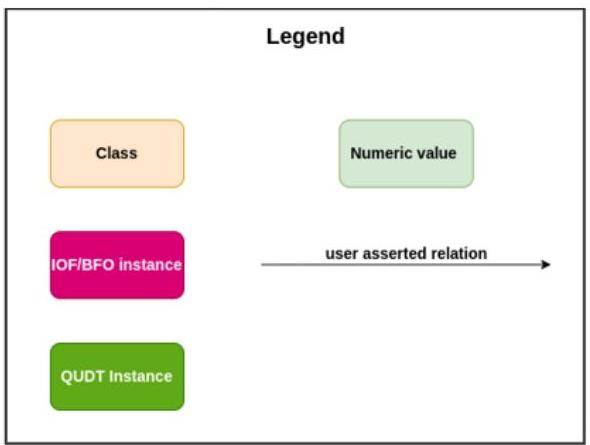
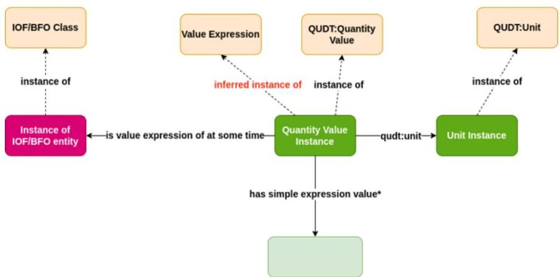
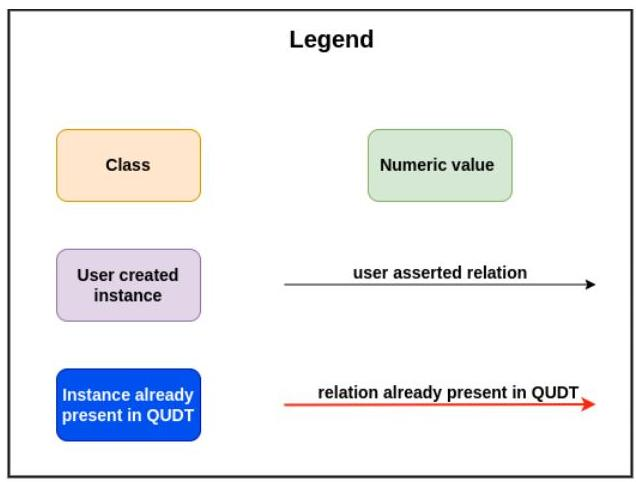
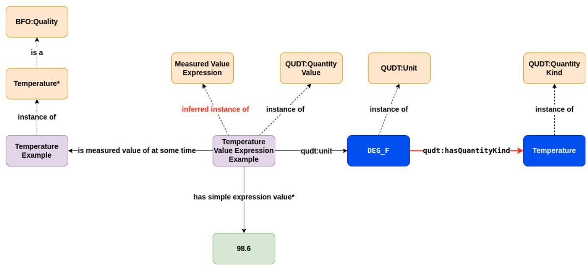
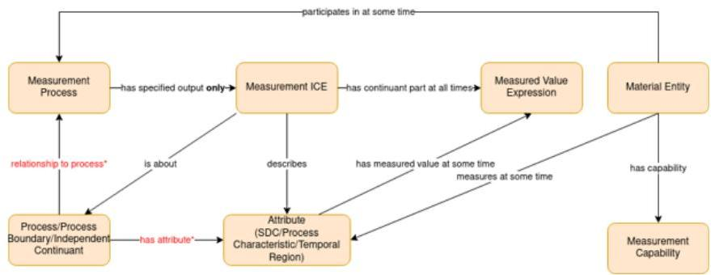
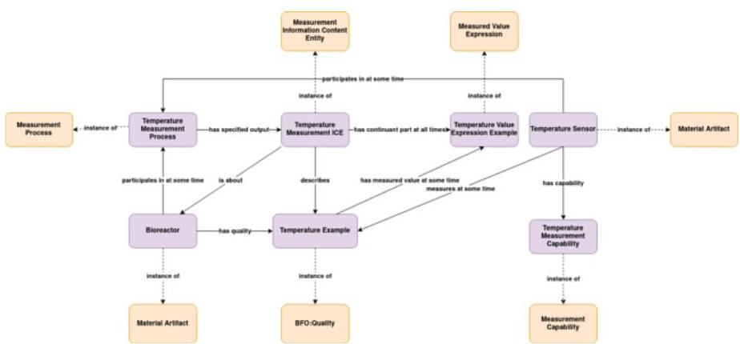
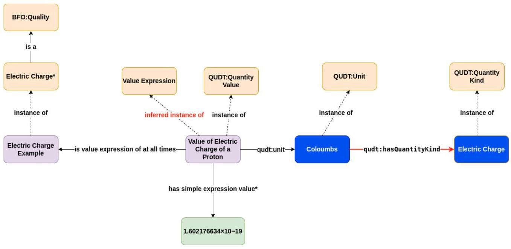
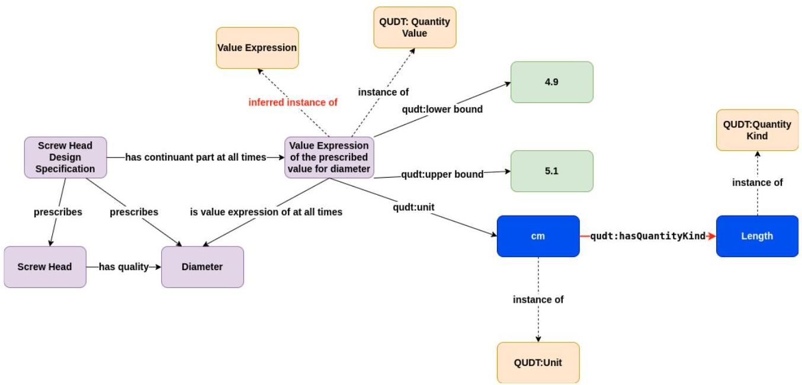
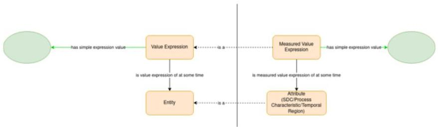
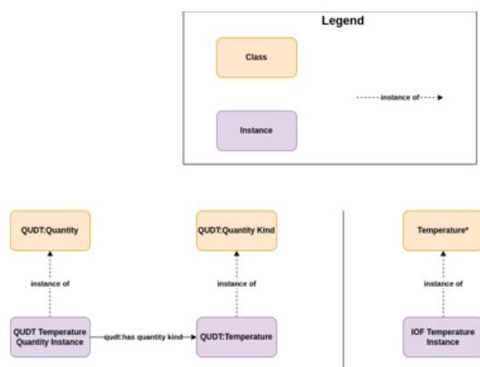

# Page 1

6‰Þ

# Page 1

Guideline for Using QUDT, if were to use with IOF Ontologies

|  Version | Editors/Authors | Change Note  |
| --- | --- | --- |
|  1.0 | Milos Drobnjakovic (NIST), Boonserm (Serm) Kulvatunyou (NIST) | Approved by IOF TOB October, 2023. First version  |

# 1 Purpose

The goal of this document is to provide IOF users with a consistent pattern for expressing magnitude in IOF-ontology-compliant data via the QUDT ontology. The intention is for this guide to be an interim, non-normative guide while the IOF community is still working on its BFO aligned quantity and unit ontology. Although it is NOT required to follow this guideline when using QUDT, doing so can benefit some reasoning capability, interoperability, ease of future migration when an IOF quantity and unit became available.

# 2 Scope

As the goal of QUDT is the representation of quantitative and semi-quantitative magnitudes, this document excludes any guide to the representation of qualitative values (values within a classification scale).

# 3 Conventions used in this document

These keywords do not constitute requirements to follow this guideline when using QUDT. They indicate the requirements if this guideline is to be followed.

1. All ontology constructs (OWL classes, object properties, and data properties) outside of the definition subsections are given in italic.
2. Data properties and Object properties are written as all lower case.
3. Classes are written with space separated names, each component of which begins with a capitalized letter.
4. All QUDT constructs are prefixed with qudt:
5. All IOF Core constructs have no prefix.
6. The keyword MUST means that the associated statement is an absolute requirement for the implementation of the guideline.

# Page 2

7. The keyword MUST NOT means that the associated statement is an absolute prohibition for implementation of the guideline.

8. The keyword SHOULD means that there may exist valid reasons in particular circumstances to ignore a particular statement, but the full implications must be understood and carefully weighed before choosing a different course.

9. The keyword SHOULD NOT means that there may exist valid reasons in particular circumstances when the particular behavior is acceptable or even useful, but the full implications should be understood, and the case carefully weighed before implementing any associated statement.

*The Conventions 6-9 were adapted from Internet Engineering Task Force (IETF) Request For Comments (RFC) 2119.

**Warning:** The syntax used to refer to ontology constructs in this document has been chosen to be consistent for ease of reading and to visually distinguish classes and properties. However, because the ontologies themselves were developed in different communities with different naming conventions, styles for actual construct identifiers and labels vary. Users should refer to specifications and/or documentation (such as the gudt catalog) for these ontologies to determine actual construct names or labels to use to reference the constructs when using them with technical tools.

## 4 Usage of QUDT with IOF Core

1. Import QUDT into IOF Core. QUDT constructs MUST NOT be disjoint with any BFO or IOF constructs.

2. For representing a value of an entity with respect to a particular unit, the users MUST use qudt:Quantity Value. Each instance of qudt:Quantity Value MUST be connected to an entity whose value it represents. The object property used for the connection MUST be is value expression of at some time or one of its subproperties. By reasoning, the instance of the qudt: Quantity Value will be inferred as an instance of Value Expression.

3. To connect an instance of qudt:Quantity Value to a particular unit, the users MUST use qudt:unit.*

4. To connect an instance of qudt:Quantity Value to a numeric value, the users MUST use the data property qudt:numeric value or has simple expression value.

*For details on QUDT constructs, see Appendix. For details on introducing new units, see section 6.

The pattern described in the instructions above is given in Figure 1.

# Page 3

Figure 1 Pattern for utilizing QUDT within IOF to represent magnitude (value of an entity with respect to a particular unit)

* instead of has simple expression value, qudt:numeric value may be used

# 5 Examples of using IOF Core with QUDT

# 5.1 Representation of measurements

Description of the example: The temperature of a bioreactor was measured at some point during the upstream production phase by a temperature sensor. The value reported by the sensor was 98.6 F.

# 5.1.1 Representation of measured values

1. Create an instance of Temperature* and the instance of qudt:Quantity Value. This instance of qudt:Quantity Value represents the measured value of the instance of Temperature.
* Temperature is currently not a class within IOF Core. If introduced to the IOF Core Temperature would be a SubClassOf BFO:Quality and MUST NOT be confused with the instance of qudt:Quantity Kind - Temperature
2. Connect the instance of qudt:Quantity Value to the instance of Temperature by using is measured value of at some time.
3. Connect the instance of qudt:Quantity Value to the qudt:Unit DEG_F by using qudt:unit.

# Page 4

4. Connect the instance of qudt:Quantity Value to the literal 98.6 by using has simple expression value or qudt:numeric value.

The result of following the instructions is depicted in Figure 2. It should be noted that, as specified in the Appendix, the connection between the instance of qudt:Unit and the instance of qudt:Quantity Kind is not user-defined and is already contained within the QUDT. Also, as stated in Section 4, by using the property is measured value of at some time, the instance of qudt:Quantity Value will be inferred as an instance of Measured Value Expression.

It should also be noted that while in this example the instance of qudt:Quantity Kind and the instance of BFO:Temperature both depict Temperature, this is not a necessity and in fact the two Temperatures serve a different purpose. The qudt:Quantity Kind is strictly associated with identifying the observable property (for further information see the definition of qudt:Quantity Kind and QUDT resources given in the Appendix) that is the basis for a given qudt:Unit. BFO:Temperature is used for representing the Universal Temperature whose instances 'depend on' a particular individual. For more information about qudt:Quantity Kind and its intended use with Units as well as the introduction of new Units, the user should look at the Appendix and Section 6.

# Page 5

Figure 2 Example of using IOF Core and QUDT for representing measured values.

*Instead of using has simple expression value, qudt:numeric value may be used. Temperature is currently not a class within IOF Core. If introduced to the IOF Core Temperature would be a SubClassOf BFO:Quality.

# 5.1.2 Tying measured values to measurement process

The goal of this section is to demonstrate how the concepts within the IOF Core can be used to represent the rest of the example problem statement: The temperature of a bioreactor was measured at some point during the upstream production phase by a temperature sensor.

# 5.1.2.1 The IOF Core measurement process design pattern

Measurement Process is defined as a "planned process to determine the value of an attribute (Specifically Dependent Continuant or Temporal Region or Process Characteristic) of an entity of interest." This definition imposes several requirements:

- By being a Planned Process, a Measurement Process needs to have an associated Plan Specification that prescribes how the measurement is performed.

# Page 6

- Determining the value means that each Measurement Process has participant at some time a Material Entity (e.g., sensors) that is capable of measuring the value of the said attribute.
- By stating that the attribute belongs to an entity of interest, the link between the Measurement Process and the entity of interest needs to be established.

While not stated in the definition, measuring results are recorded as a Measurement Information Content Entity. Measurement Information Content Entity has the Measured Value Expression as a part and, at the very minimum, references the attribute through the property describes as well as the entity of interest through the property is about.

In other words, the Measurement Information Content Entity contains the measured value and any additional relevant measurement metadata (at the very minimum, which attribute is measured and to which entity it belongs). The representation of this IOF Core design pattern is given in Figure 3.

Figure 3 Core design pattern for representing the measurement process and the corresponding measurement ICE.

*The legend for Figure 4 is the same as the legend for Figure 2;

has attribute is not a property within the core but is instead a “shortcut” that represents the properties of linking attributes to the entity of interest; relationship to process is also a “shortcut” that represents the properties of linking the entity of interest to the measurement process. The detailed specification of which properties should be used to link an attribute to an entity of interest or to link an entity of interest to a measurement process is given within the first order logic (FOL) and explanatory notes within the Measurement Process class in the IOF Core.

5.1.2.2 Applying the IOF Core measurement process design pattern on the example

# Page 7

With the IOF Core design pattern in mind, the remainder of the example can be represented as follows:

1. Create an instance of Bioreactor (Instance of: Engineered System), an instance of Measurement Process, an instance of Temperature Sensor (Instance of: Material Artifact), an instance of Measurement Capability, and an instance of Measurement Information Content Entity.
2. Connect the instance of Bioreactor to the instance of Measurement Process by using participates in at some time.
3. Connect the instance of Bioreactor to the instance of Temperature by using has quality.
4. Connect the instance of Temperature Sensor with the instance of Measurement Capability by using has capability.
5. Connect the instance of Temperature Sensor with the instance of Temperature by using measures at some time.
6. Connect the instance of Temperature Sensor with the instance of Measurement Process by using participates in at some time.
7. Connect the instance of Measurement Process with the instance of Measurement Information Content Entity by using has specified output.
8. Connect the instance of Measurement Information Content Entity to the instance of Temperature by using describes.
9. Connect the instance of Measurement Information Content Entity to the instance of Bioreactor by using is about.

The result of following the instructions is depicted in Figure 4. The Temperature Value Expression Example and Temperature Example are intended to represent the same instances depicted in Figure 2. As noted in Subsection 5.1.1, the Temperature Value Expression represents the measured value of the instance of Temperature. The Temperature Measurement ICE has the magnitude as part but also contains other metadata relevant to measurement (minimally the information given in Figure 4: it describes the instance of Temperature (attribute) and is about the instance of Bioreactor (the entity of interest that the attribute belongs to).

# Page 8

Figure 4 Representation of the measurement process, the corresponding measurement ICE, and their link to measured value expression.

*The legend for Figure 4 is the same as the legend for Figure 2.

# 5.2 Representation of physical constants using IOF Core and QUDT

Description of the example: The elementary charge, usually denoted by  $e$  is the electric charge carried by a single proton. In the SI system of units, the value of the elementary charge is exactly defined as  $e = 1.602176634 \times 10^{-19}$  coulombs. (Adapted from Wikipedia: https://en.wikipedia.org/wiki/Elementary charge)

1. Create an instance of Electric Charge* and an instance of qudt:Quantity Value. This instance of qudt:Quantity Value represents the constant value of the instance of Electric Charge.
* Electric Charge is currently not a class within IOF Core. If introduced to the IOF Core Electric Charge would be a SubClassOf BFO:Quality and MUST NOT be confused with the instance of qudt:Quantity Kind - Electric Charge
2. Connect the instance of qudt:Quantity Value to the instance of Electric Charge by using is value expression of at all times.
3. Connect the instance of qudt:Quantity Value to the instance of qudt:Unit Coloumbss by using qudt:unit.
4. Connect the instance of qudt:Quantity Value to the literal 1.602176634x10^-19 by using has simple expression value or qudt:numeric value.

The result of following the instructions is depicted in Figure 5. The protocol for representing constants is very similar to representing measured values. The notable difference is the use of is value expression of at all times instead of is measured value at some time. While the electric charge of a proton can be experimentally determined, and hence is measured value at some time could potentially be used, in this case, specifically, the value represented is the constant given within the SI unit system. No concrete experiment is associated with the

# Page 9

value, so the 'is value expression of' MUST be used. Additionally, this constant value is valid for the entire existence of the individual proton in question, which is why is value expression of at all times MUST be used in contrast to is value expression of at some time.

Figure 5 Example of using IOF Core and QUDT for representing a physical constant.

*The legend for Figure 5 is the same as the legend for Figure 2;

instead of using has simple expression value, qudt:numeric value may be used. Electric Charge is currently not a class within IOF Core. If introduced to the IOF Core Electric Charge would be a SubClassOf BFO:Quality.

# 5.3 Representation of specified values using IOF Core and QUDT

Description of the example: The design specification for a screw head specifies that a screw head has a diameter between 4.9 and 5.1 cm.

1. Create an instance of Diameter (Instance of BFO:Quality), instance of Design Specification and an instance of Screw Head (Instance of Material Artifact), and the instance of qudt:Quantity Value. This instance of qudt:Quantity Value represents the specified value of Diameter (Instance of qudt:Quantity Value).
2. Connect the instance of qudt:Quantity Value to the instance of Diameter by using is value expression of at all times.
3. Connect the instance of qudt:Quantity Value to the qudt:Unit cm by using qudt:unit.
4. Connect the instance of the qudt:Quantity Value to the literals 4.9 and 5.1 by using qudt:lower bound and qudt:upper bound, respectively.

# Page 10

5. Connect the instance of Design Specification to the instance of qudt:Quantity Value by using has continuant part at all times.
6. Connect the instance of Screw Head to the instance of Diameter by using has quality.
7. Connect the instance of Design Specification to the instance of Screw Head and the instance of Diameter by using prescribes.

The result of following the instructions is depicted in Figure 6. This example demonstrates how ranges can be represented with QUDT by using qudt:upper bound and qudt:lower bound. If more precision is warranted concerning the exclusivity or inclusivity of the endpoint values, subdata properties of the qudt:upper bound and qudt:lower bound can be used (e.g., qudt:max exclusive and qudt:min exclusive). Also, it demonstrates that 1) specifications MUST NOT be used directly to represent the respective values, 2) specifications and the respective Value Expressions (qudt:Quantity Values) MUST be connected through the BFO:parthood relations (Specifically - BFO:has continuant part some time or any of its subproperties) and 3) the specified value MUST be the specified value of an entity that is prescribed by the specification. It should be noted that the IOF Core might introduce a new SubClassOf:Value Expression to represent 'specified values'.

In this example, has value expression at all times is used. The reason is that even though the measured (physical) magnitude of the diameter might change (e.g., through heating and cooling of the screwhead), the specified value of the screwhead does not. In other words, it remains the same throughout the existence of the screw, which is why 'at all times' is used instead of 'at some time'.

Figure 6 Example of using IOF Core and QUDT for representing specified values.

*The legend for Figure 6 is the same as the legend for Figure 2.

# Page 11

6 Introducing new units

The introduction of new units MUST NOT be done if the unit already exists as an instance within QUDT. In the case a unit is not present the introduction of a unit MUST be done as follows:

1. The introduction of new units MUST follow the recommended QUDT method for adding units: https://github.com/qudt/qudt-public-repo/wiki/Unit-Vocabulary-Submission-Guidelines
2. Each unit MUST be created as an instance that is an instance of qudt:Unit.
3. Each unit MUST be connected to an appropriate instance of qudt:Quantity Kind by using qudt:has quantity kind.
4. Each new unit MUST use the IOF Core IRI: https://spec.industrialontologies.org/ontology/core/Core/

Appendix

I Definitions

The purpose of this section is to provide all the definitions that are relevant to or are used directly within this document.

QUDT definitions

qudt:Quantity: measurement of an observable property of a particular object, event, or physical system

qudt:Quantity Kind: any observable property that can be measured and quantified numerically

qudt:Quantity Value: expression of the magnitude and kind of a quantity and is given by the product of a numerical value n and a unit of measure U

qudt:Unit: particular quantity value that has been chosen as a scale for measuring other quantities of the same kind (more generally of equivalent dimension)

qudt:value: property to relate an observable thing with a value of any kind

qudt:numeric value: No definition provided. From our understanding, it can be defined as: property to relate a qudt: Quantity or qudt: Quantity value to a numeric magnitude (e.g., float, integer)

# Page 12

qudt:unit: reference to the unit of measure of a quantity (variable or constant) of interest

qudt:upper bound: No definition provided. From our understanding, it can be defined as: property to relate a qudt: Quantity or qudt: Quantity value to a maximal (inclusive or exclusive) numeric value that the qudt: Quantity or qudt: Quantity value is permitted to have

qudt:lower bound: No definition provided. From our understanding, it can be defined as: property to relate a qudt: Quantity or qudt: Quantity value to a minimal (inclusive or exclusive) numeric value that the qudt: Quantity or qudt: Quantity value is permitted to have

# IOF Core/BFO definitions

BFO:Entity: anything that exists or has existed or will exist

BFO:Independent Continuant: entities that continue to persist through time and whose existence is independent of other entities

BFO:Specifically Dependent Continuant: entity that cannot exist without a bearer (attribute of an independent continuant)

BFO:Temporal Region: portion of time

Process Characteristic: attribute of a process

Information Content Entity: content or a pattern (generically dependent continuant) that is about some entity

Value Expression: information content entity that contains a value of an entity within a classification scheme or on a quantitative scale

Measured Value Expression: value expression that contains the measured value of an attribute (specifically dependent continuant or process characteristic or temporal region)

Measurement Process: planned process to determine the value of an attribute (specifically dependent continuant or temporal region or process characteristic) of an entity of interest

Measurement Information Content Entity: informational content that is the result of measuring a set of attributes (specifically dependent continuant or process characteristic or temporal region) belonging to the entity (independent continuant or process or process boundary) the informational content is about

Measurement Capability: capability of a material entity to measure the value of some entity

is value expression of at some time: relation from a value expression to the entity indicating that the value expression contains the value of the entity determined or set at some time t

is value expression of at all times: relation from a value expression to an entity indicating that the value expression contains the value of the entity which does not change during the entire existence of the entity

# Page 13

is measured value of at some time: relation from a value expression to the entity indicating that the value expression contains the value of the entity measured at some time t

measured by at some time: relation from an entity to a material entity with a measurement capability that got realized to determine the value of the entity, at some time

has simple expression value: data property that relates a value expression to a literal

II Table depicting the Labels, as given in the ontologies, as well as the IRIs of constructs referenced in this document

|   | Construct as referenced in this document | Label | IRI  |
| --- | --- | --- | --- |
|  1 | qudt:Quantity | Quantity | http://qudt.org/sche ma/qudt/Quantity  |
|  2 | qudt:Quantity Kind | Quantity Kind | http://qudt.org/sche ma/qudt/QuantityKin d  |
|  3 | qudt:Quantity Value | Quantity value | http://qudt.org/sche ma/qudt/QuantityValue  |
|  4 | qudt:Unit | Unit | http://qudt.org/sche ma/qudt/Unit  |
|  5 | qudt:value | value | http://qudt.org/sche ma/qudt/value  |
|  6 | qudt:numeric value | numeric value | http://qudt.org/sche ma/qudt/numericVal ue  |
|  7 | qudt:unit | unit | http://qudt.org/sche ma/qudt/unit  |
|  8 | qudt:upper bound | upper bound | http://qudt.org/sche ma/qudt/upperBoun d  |
|  9 | qudt:lower bound | lower bound | http://qudt.org/sche ma/qudt/lowerBound  |

# Page 14

|  10 | BFO:Entity | entity | http://purl.obolibrary.org/obo/BFO_0000001  |
| --- | --- | --- | --- |
|  11 | BFO:Independent Continuant | independent continuant | http://purl.obolibrary.org/obo/BFO_0000004  |
|  12 | BFO:Specifically Dependent Continuant | specifically dependent continuant | http://purl.obolibrary.org/obo/BFO_0000020  |
|  13 | BFO:Temporal Region | temporal region | http://purl.obolibrary.org/obo/BFO_0000008  |
|  14 | Process Characteristic | process characteristic | https://spec.industrialontologies.org/ontology/core/Core/ProcessCharacteristic  |
|  15 | Information Content Entity | information content entity | https://spec.industrialontologies.org/ontology/core/Core/InformationContentEntity  |
|  16 | Value Expression | value expression | https://spec.industrialontologies.org/ontology/core/Core/ValueExpression  |
|  17 | Measured Value Expression | measured value expression | https://spec.industrialontologies.org/ontology/core/Core/MeasuredValueExpression  |
|  18 | Measurement Process | measurement process | https://spec.industrialontologies.org/ontology/core/Core/MeasurementProcess  |
|  19 | Measurement Information Content Entity | measurement information content entity | https://spec.industrialontologies.org/ontology/core/Core/Meas  |

# Page 15

|   |  |  | urementInformation
ContentEntity  |
| --- | --- | --- | --- |
|  20 | Measurement Capability | measurement capability | https://spec.industrialontologies.org/ontology/core/Core/MeasurementCapability  |
|  21 | is value expression of at some time | is value expression of at some time | https://spec.industrialontologies.org/ontology/core/Core/isValueExpressionOfAtSomeTime  |
|  22 | is value expression of at all times | is value expression of at all times | https://spec.industrialontologies.org/ontology/core/Core/isValueExpressionOfAtAllTimes  |
|  23 | is measured value of at some time | is measured value of at some time | https://spec.industrialontologies.org/ontology/core/Core/isMeasuredValueOfAtSomeTime  |
|  24 | measured by at some time | measured by at some time | https://spec.industrialontologies.org/ontology/core/Core/measuredByAtSomeTime  |
|  25 | has simple expression value | has simple expression value | https://spec.industrialontologies.org/ontology/core/Core/hasSimpleExpressionValue  |

## III Design patterns

The purpose of this section is to provide resources and give a brief overview of patterns present in QUDT and IOF Core related to magnitude representation.

## IOF Core design pattern

# Page 16

The IOF Core Design Pattern is given in Figure A.1. The central point of the IOF Core design pattern is the notion of Value Expression. Per the definition, Value Expression is an Information Content Entity that contains a value of an entity within a classification scheme or on a quantitative scale. This definition implies that each instance of Value Expression MUST belong to a particular individual. The IOF Core introduces a direct relationship to link the value expression to an entity in question: is value expression of at some time and is value expression of at all times. The two different properties (and their respective subproperties) are used depending on if the value holds for the entire existence of the entity or only for a specific time interval.

The class Value Expression is further subclassed by the Measured Value Expression class. Measured Value Expression is defined as a Value Expression that contains the measured value of an attribute. In other words, Measured Value Expression is used to represent quantity values resulting from physical measurements. Given that only the attributes (e.g., temperature, reaction rate, process duration) can be physically measured, the Measured Value Expression MUST point to an attribute (BFO: Temporal Region, BFO: Specifically Dependent Continuant or BFO: Process Characteristic). To link the Measured Value Expression to an attribute, the subproperty of is value expression of at some time has been introduced - is measured value expression of at some time.

The IOF Core, however, has not formalized units (quantitative scales) or classification schemes and only contains has simple expression value to connect a Value Expression to a literal.

Figure A.1 IOF Core magnitude representation pattern

# QUDT design pattern

The details of the QUDT design pattern are given on the official QUDT webpage https://www.qudt.org/pages/HomePage. and are, as such, not replicated in this guideline. The rest of the section is a commentary pertaining to which parts of the QUDT design patterns SHOULD NOT or MUST NOT be used with IOF Ontologies.

1. The concept of qudt:Quantity per the QUDT guide and the definition seems to be an aggregate of the physical phenomena/attribute that is being represented and its 'measured

# Page 17

value.' These concepts have a clear delineation in the IOF Core ontology. As such, qudt:Quantity SHOULD NOT be used. However, if used, the interpretation that it represents the physical phenomena MUST be adhered to, and, thus, the axiom that qudt:Quantity is a SubclassOf: (Process characteristic or BFO:Temporal Region or BFO:Specifically Dependent Continuant) MUST be added.

2. Per the official QUDT guideline, the pattern in which a numerical value and a unit are directly linked to a qudt:Quantity (in our interpretation physical phenomena/attribute) is permissible. However, this pattern MUST NOT be used in IOF. Instead, any representation of numerical value unit pair MUST be done according to the instructions provided in the previous sections of this guideline.
3. The QUDT places the notion of "Quantity" at the central point of its design pattern. The "type" (e.g., temperature, mass) of a qudt:Quantity is then asserted indirectly by connecting the qudt: Quantity to qudt:Quantity Kind. The IOF adheres to the principles outlined in BFO whereby the "type of" qudt:Quantity would be asserted directly on the Universal level (e.g., any instance of Temperature would be an instance of the Temperature class under IOF/BFO as opposed to being an instance of Quantity that is then connected to an appropriate Quantity Kind, as given in Fig A.2). Therefore, asserting the "type of" instances of classes that would fall in the scope of qudt:Quantity (see point 1 above) by connecting them to the qudt:Quantity Kind MUST NOT be used.

Figure A.2 Representation of the "quantity type" within QUDT (left) and IOF (right)

*If introduced to the IOF Core Temperature would be a SubClassOf BFO:Quality.

# IV Useful Links

QUDT Website:

https://www.qudt.org/pages/HomePage.

IOF Website:

# Page 18

Industrial Ontologies

User Guide for qudt:

- User Guide for QUDT

The IOF Core Version beta paper:

https://ceur-ws.org/Vol-3240/paper3.pdf

The IOF repository:

- GitHub - iofoundry/ontology

The IOF Core repository:

- ontology/core at master · iofoundry/ontology

