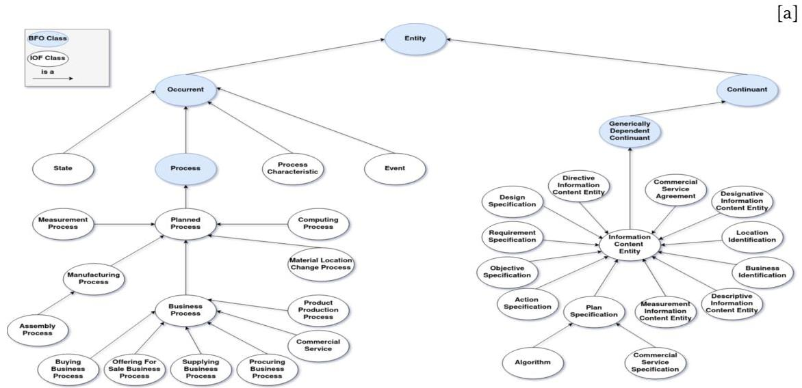
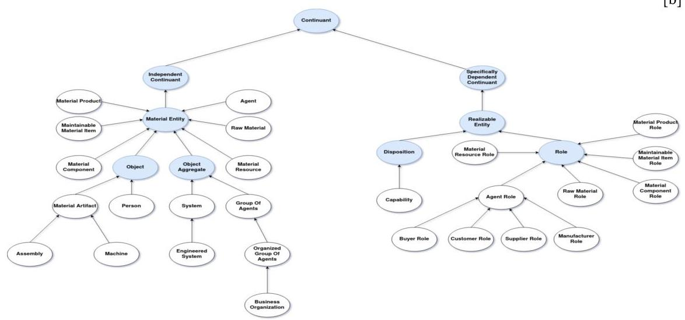

# Page 1

6‰Þ

# Page 1

CEUR-WS.org/Vol-3240/paper3.pdf

# The Industrial Ontologies Foundry (IOF) Core Ontology

Milos Drobnjakovic$^{1,*}$, Boonserm (Serm) Kulvatunyou$^{1}$, Farhad Ameri$^{2}$, Chris Will$^{3}$, Barry Smith$^{4}$ and Albert Jones$^{1}$

$^{1}$National Institute of Standards and Technology, 100 Bureau Drive, Gaithersburg, MD 20899, USA
$^{2}$Texas State University, 601 University Dr, San Marcos, TX 78666, USA
$^{3}$Dassault Systèmes, 7135 S Decatur Blvd, Las Vegas, Nevada 89118, USA
$^{4}$University at Buffalo, Buffalo, NY 14260, USA

# Abstract

The Industrial Ontologies Foundry (IOF) was formed to create a suite of interoperable ontologies. Ontologies that would serve as a foundation for data and information interoperability in all areas of manufacturing. To ensure that each ontology is developed in a structured and mutually coherent manner, the IOF has committed to the tiered architecture of ontology building based on the Basic Formal Ontology (BFO) as top level. One of the critical elements of a successful tiered architecture build is the domain mid-level ontologies. However, thus far there has been no mid-level manufacturing ontology that is based on BFO. The IOF has recently released the IOF Core version 1 beta to fill this gap. This paper documents the development process and gives an overview of the current content of the IOF Core. Finally, the paper describes how the IOF Core can be used as the basis for a more domain-specific Supply Chain Ontology.

# Keywords

Ontology, Semantic interoperability, Industrial Ontologies Foundry, Manufacturing, Industry 4.0

# 1. Introduction

With the ever-growing importance of using digital data as inputs to manufacturing-based, enterprise-intelligence, software tools, there is a need to represent that data in a consistent and interoperable manner – regardless of the manufacturing domains [1, 2]. To meet this need, “interface” standards have historically been the crucial enablers. Recently, however, ontologies have been recognized as a more modern and technically sound way to meet that same need. Ontologies can be thought of as the next generation of “smart manufacturing” standards [3]. While manufacturing-related ontologies do exist, they have been developed independently from each other and are, thus, based on viewpoints and principles that might not be mutually coherent and consistent. Consequently, these ontologies are difficult and costly to use to connect data across each manufacturing domain. The Industrial Ontologies Foundry (IOF) initiative was formed to overcome such barriers [3, 4].

FOMI 2022: 12th International Workshop on Formal Ontologies meet Industry, September 12-15, 2022, Tarbes, France
*Corresponding author.
milos.drobnjakovic@nist.gov (M. Drobnjakovic); boonserm.kulvatunyou@nist.gov (B. (. Kulvatunyou); ameri@txstate.edu (F. Ameri); chris.will@outlook.com (C. Will); phismith@buffalo.edu (B. Smith); albert.jones@nist.gov (A. Jones)
© 2022 Copyright for this paper by its authors. Use permitted under Creative Commons License Attribution 4.0 International (CC BY 4.0).
CEUR Workshop Proceedings (CEUR-WS.org)

# Page 2

The IOF initiative comprises an international community of academia, industry, and research institutes. It was formed to create a set of mutually consistent, open-source ontologies. Ontologies that would provide a basis for data and knowledge representation across all aspects of manufacturing. To be that basis, the IOF ontological suite must provide a modular and simple grounding point upon which domain-dependent or application-specific ontologies can be developed *[4]*. The current work of the IOF has been inspired by the successful and beneficial efforts of the Open Biomedical Ontology (OBO) Foundry. OBO has already provided many benefits in the biological domain *[5]*.

The IOF uses the tiered architecture approach *[2]* for building its ontological suite. It involves, first, committing to a domain-independent (top-level) ontology, which will serve as a hub or topmost tier. Next, one or more mid-level tier ontologies are developed by utilizing the top-tier ontology definitions as a starting point. The resulting, mid-level ontologies are still quite general but they model in each case particular general domains of interest (here, the manufacturing domain). From the mid-level ontologies, domain-specific ontologies that are more specialized (e.g., a supply chain ontology) can be developed. Finally, from the domain ontologies, application ontologies that model a narrow domain of a given ontological application, for example relating to supply chain products, can be derived *[4]*.

The described approach ensures that the ontologies are developed in a structured, mutually coherent manner. While the top-level and domain-specific ontologies currently exist, there is a lack of mid-level manufacturing ontologies that are broad enough to be a basis across all manufacturing domains *[3]*. That is, the currently available mid-level manufacturing ontologies - such as the Manufacturing Semantics Ontology (MASON) *[6]* or the Manufacturing Reference ontology (MRO)*[7]* - cover only a subset of the entire manufacturing domain *[8]* (e.g., product manufacturing and design) and they have limited mutual interoperability *[2]*. Therefore, the IOF has developed its own mid-level manufacturing ontology: the IOF Core ontology. The results of our effort to create the IOF Core ontology, to which more domain-specific ontologies within the IOF ecosystem will be aligned, are presented in what follows.

In the rest of the paper, the recently released IOF Core version 1 beta is discussed. First, we discuss our development process and provide a rationale behind our term selections. Next, an overview of the classes and their respective definitions will be provided. Finally, to demonstrate the applicability of the core as a basis for a domain ontology, a use case of the IOF Core as a basis for the Supply Chain Reference Ontology (SCRO) will be outlined.

## 2 IOF Core Development Methodology

The IOF Core started as a proof-of-concept project 5 years ago and has been built using the top-down approach *[9]*, which involved selecting high-level terms from roughly 30 submissions from the manufacturing domain experts. Terms in the 30 submissions were mapped according to the provided natural language definitions and about 20 most cited terms were selected for formalization. The selected terms were then further refined, typically with the aid of domain experts and in a collaborative way that ensures that the terms that form the basis of a specific domain are present and modeled in a domain-consistent manner. The details of the mapping procedure and further rationale for term selection are given in *[3]*.

###

# Page 3

After the 20-term set was formalized, new terms were added to the IOF Core. Those added terms were required for two reasons. First, so that we could provide axioms for each term in the 20-term set. Second, so that the other IOF working groups can use the IOF Core as a basis for more specialized domain ontologies.

To adhere to the tiered approach, the IOF Core was developed from, and aligned with, a domain-independent (sometimes called a domain neutral) ontology. There are two advantages of aligning with such a domain-neutral ontology. First, it provides and enables a domain-independent starting point. Second, it enforces a further structure on the mid-level ontology. A structure where each term promotes a high-level consistency even before relations outside of the domain of interest can be established.

For this purpose, the IOF Core is aligned with a domain-neutral ontology called the Basic Formal Ontology (BFO) *(10)*. There are several reasons for this alignment. BFO has already demonstrated its value for making disparate ontologies or data models within the biological and other domains in an interoperable manner *(11)*. BFO has a large user base. And, BFO can be considered a top-level ontology choice for 1) mid-level ontologies such as the Common Core *(12)* as well as 2) more domain-specific ontologies such as the Physics-Based Simulation Ontology*(13)* and many more *(14)*. BFO is already a top-level ontology of choice for multiple domain and application manufacturing ontologies, such as ROMAIN *(15)* (a reference ontology for industrial maintenance) and the Product Lifecycle (PLC) Ontology for Additive Manufacturing *(16)*. Moreover, BFO is relatively compact, having only 35 classes, which makes its utilization comparatively more straightforward than some larger, top-level ontologies *(17)*. Finally, BFO is well documented and maintained in a manner that ensures long-term support and stability *(10)* that has been accredited as a top-level ontology in ISO/IEC 21838-2.

## 3. IOF Core Version 1 Beta Overview and Hierarchy

Prior to its release, the IOF Core version beta went through two internal review cycles. There, the IOF members reviewed the core and added suggestions for class and property improvements or pointed out any inconsistencies by using Jira. In total, around 60 distinct comments were created and subsequently addressed by the IOF Core development team. Afterward, the IOF Core was assessed and voted on by the IOF working group (WG) chairs for release. The release criteria considered by the WG chairs included 1) term applicability in one or more manufacturing domains 2) annotation completeness and conformance with the established IOF annotation guidelines 3) comprehensibility of terms by the subject-matter experts (SMEs) 4) axiomatic and natural language coherency with the common domain understanding of terms 5) absence of redundancy within the term-set. As an additional test, the IOF Core was also classified with Hermit reasoner *(18)* and showed no logical inconsistencies.

The released version beta of the IOF Core ontology is publicly available at https://github.com/iofoundry/Core.It consists of 57 OWL classes and 38 OWL properties. There are two types of classes: primitive and defined. Primitive classes are either 1) so basic to our understanding that it is impossible to define them without circularity, 2) we currently cannot identify a useful set of necessary and sufficient conditions, 3) there are insufficient terms in our current scope to formulate such conditions, or 4) there is still insufficient agreement among domain experts as to

# Page 4

what such conditions should be. Primitive classes, in most cases, are provided with necessary conditions, along with examples to help users understand the intended meaning.

On the other hand, defined classes provide a true definition of the term. 'True' means that we can formulate both a set of necessary conditions and a set of sufficient conditions. Of the IOF Core's current 57 classes, 37 are primitive while 20 are defined. It should be noted that the number of primitive classes can be reduced by introducing new properties as primitives. Nevertheless, the IOF Core development team seeks, as far as possible, to reuse existing properties. An overview of the IOF Core class hierarchy and its alignment with BFO are shown in Figure 1.

[a]

[b]
Figure 1: Fragment of the BFO class hierarchy aligned with IOF Core classes. [a] depicts alignment with the occurrent and generically dependent continuant branches of BFO. [b] depicts alignment with the independent continuant and specifically dependent continuant branches of BFO.

# Page 5

The IOF Core, just like the BFO, divides all entities into the two disjoint categories: *continuant* and *occurrent* *[19]*. *Continuants* are defined as “entities that continue to persist through time while maintaining their identity”. They can be further split into independent and dependent continuants. *Independent continuants* do not depend on other entities (which would be their bearers) for their existence (e.g., person, machine, product). *Dependent continuants* cannot exist without an *independent continuant* bearer. Examples of dependent continuants are the qualities of a product or the role of a person within some organization. Dependent continuants can be further split into *generically dependent continuants* and *specifically dependent continuants*. *Generically dependent continuants* can migrate between multiple bearers during its existence; *specifically dependent continuants* cannot. Examples of *generically dependent continuants* (GDC) are information content entities such as an email or an image or a specification.

*Occurents*, on the other hand, are “entities that occur, happen or unfold in time”. *Occurrents* thus can be entities that 1) are a part of time, such as a time instant or time period, or 2) exist in time by occurring or happening such as a manufacturing process, or 3) represent a boundary of an occurrence or happening such as the beginning of a process.

IOF Core also commits to maintaining what is called a mono-hierarchy of classes. In other words, each class is explicitly asserted to be a subclass of maximally one, immediate, parent class. Each case may, however, be determined by inference to be a subclass of other classes based on their necessary and sufficient conditions. IOF Core thus makes a distinction between asserted and inferred relations between its classes, where the former constitutes a mono-hirearchy.

The terms provided by BFO represent a domain-neutral foundation for modeling many different domains. Consequently, to appropriately model a domain of interest, the framework provided by BFO needs to be expanded with a set of mutually consistent and domain-specific terms. The following section provides an explanation of how the IOF Core extends BFO to represent any industrial domain at a high level. The remainder of the text will be focused primarily on classes that are direct subclasses of BFO classes.

### 3.1 Information Content Entities

An *information content entity* can be defined as a “GDC that *is about* some entity”. The *is about* relationship is a generic one that connects the information content entity to the entity to which it references. The choice of this definition has two important consequences. First, by making the information content entity a subclass of GDC, and by not imposing any further requirements concerning the nature of its bearer, the information is not yet bound to the medium on which it is expressed. Thus, if the information is the same across multiple bearers, it will be identified as a single information content entity *[12]*. Second, the *is about* relationship allows us to draw a clear distinction between a piece of information and the entity to which it references *[20]*.

The *is about* relationship imposes no further restrictions on how the piece of information references a particular entity. However, in many industrial use cases, it is essential to know if a piece of information specifies (as in a goal or target), characterizes, or uniquely identifies an entity. Therefore, sub-classes of *is about* have been adapted from Common Core: *designates*, *prescribes*, and *describes*. These relations serve as the primary building blocks for defining most of the IOF Core subclasses of information content entities.

# Page 6

For example, designates relates an information content entity to an entity that it uniquely identifies. It is used in the definition of both location identification and business identification. Prescribes relationship is utilized in defining many specifications that are essential to industrial practices (see Table 1). Prescribes relates an information content entity to an entity for which it serves as a rule or a guide if the entity is an occurrent or as a model – in the sense of pattern – if it is a continuant.

Table 1 Natural language definitions for classes that represent specifications deemed essential for standard industry practice (italicized font indicates an ontological term)

|  Class | Natural language definition  |
| --- | --- |
|  action specification | information content entity that prescribes what participants shall do in a process  |
|  objective specification | information content entity that prescribes what the outcome of (output of) some process should be  |
|  plan specification | information content entity that has action specifications and objective specifications as parts  |
|  design specification requirement specification | information content entity that prescribes something man-made information content entity that prescribes a set of requirements  |

One of the most important classes in Table 1 is plan specification, which contains information on how a process should unfold. In other words, a plan specification consists of 1) information on the objectives of a particular process and 2) corresponding actions the participants should take to achieve these objectives. This definition is aligned with the typical understanding of process design and experimental protocols. Hence, it can serve as a foundation for defining information content entities that are specialized for any manufacturing process type. Examples include discrete, continuous, or batch manufacturing.

In addition to defining processes, industrial activities involve designing and thus prescribing many man-made entities that range from very simple tools to complex real and digital systems. The design specification class was included in the IOF Core for this purpose. While the notion of design is applicable to both processes and continuants, axiomatization of the design specification explicitly constrains it to prescribe only the continuant branch of BFO. This was done intentionally to clearly delineate between plan specification and design specification. The reason was to ensure that the usage and further subclassing of each term would be unambiguous.

# 3.2. Material Entities

A material entity is defined in BFO as an "independent continuant that has some portion of matter as its part". Given this broad definition, material entity may be used as a basis for defining many types of entities in the industrial domain. Entities that vary in complexity, size, and granularity. An important subclass of material entity in BFO is object, which is defined as a "material entity that possesses a causal unity". The relevant types of causal unities include 1) protective coverings (for example the skin of a human being), 2) internal physical forces (for example covalent bonds within a molecule of water), and 3) engineered assembly of components

# Page 7

(for example screws and joints that connect parts of a machine together) *[21]*.

Industrial processes involve the utilization of many man-made objects. Examples include a machine, a screwdriver, or a screw. Each such object can be distinguished from other types of objects since they were intentionally designed to realize a certain function. . The IOF core has therefore decided to adopt the class artifact from the Common Core Ontology; but relabeling it as material artifact. A material artifact is defined as an ”object deliberately created to have a certain function”. The notion of ’deliberately created to have a certain function’ is captured axiomatically by imposing a condition that the function of the material artifact is prescribed by a corresponding design specification. In addition to object, BFO has defined a class that represents a grouping of objects, namely object aggregate. The only constraint imposed on the class is that it needs to have at least one object as its member part. This ensures the broadness of the term and provides the flexibility left to the user to define their criteria for grouping.

The IOF has identified two important subclasses of BFO:Object Aggregate: system and group of agents. A system is an object aggregate that has two or more elements that interact with each other as its member parts. This definition is quite general. It allows further specializations of the system class within different manufacturing contexts. One such specialization, important in the industrial domain, is engineered system, which is distinguished from other systems based on being designed (prescribed by a design specification) to provide certain capabilities.

A group of agents is defined as an ”object aggregate that consists of only agents as its member parts”. This is a broad class that does not impose any further restrictions on the selection criteria that is used for including specific agents in a group. For instance, an organized group of agents comprises agents based on their pursuit of a set of common plans and objectives. In other words, agents are in an organized group to collectively realize a certain function prescribed by an information content entity (for example an objective specification). Consequently, the class is broad enough to be a foundation for defining a wide array of functional units. Units that comprise multiple agents such as business organizations and automated manufacturing cells.

In industry, it is crucial to capture the different lifecycle phases of a given material entity; phases that depend on the current set of circumstances of that entity. For example, a material entity that is the final product of manufacturer A can be utilized at another point in time as raw material by manufacturer B. While the general properties, and hence the identity, of the material entity in both phases do not change; its role changes quite drastically. For this purpose, the IOF Core has defined several industry-relevant terms that are related to the roles of a material entity, as shown in Table 2.

All the classes in Table 2 are defined classes that follow the pattern: material entity (or some set of subclasses of material entity) that has role some role x. The specific roles involved will be described in more detail in the next section. Defined classes were used to ensure that the phase of a material entity (e.g., the phase of being a material product) can be inferred through inspection of the role, while its identity (e.g., it being a machine) is still maintained and made explicit.

### 3.3. Roles

In BFO, a role is defined as an ”externally grounded realizable entity”. ’Externally grounded’ means that a role exists because its bearer is in some special physical, social, or institutional set

# Page 8

Table 2 Natural language definitions for classes that represent specific phases in a lifecycle of an entity (italicized font indicates an ontological term)

|  Class | Natural language definition  |
| --- | --- |
|  agent | person, group of persons, or engineered system with an agent role  |
|  maintainable material item | material artifact or engineered system which has the maintainable material item role  |
|  material component | material entity which has the material component role  |
|  material product | material entity which has the material product role  |
|  material resource | material entity which has the material resource role  |
|  raw material | material entity which has the raw material role  |

of circumstances. This in turn means that the role can cease to exist even though its bearer is not physically changed. To say that a role is a realizable entity means that it is exhibited only when its bearer participates in certain processes [19].

The different role subclasses that are included in the IOF Core are described below. They were used primarily to identify the context in which a material entity exhibits a role by participating in a particular processes. Material product role is defined as a "role held by a material entity when it is being offered for sale, or for supplying or is being bought". This role thus indicates that a material entity is in a position to participate in those processes. That same material entity can be registered as a material product from the moment it is available for customers. As a result, it is important to note that, this 'role' concept is flexible enough to allow, if needed, a material entity to remain a material product in a database even after the transactions occur.

Material component role is defined as a "role held by a material entity when it is a proper part of another material entity or is planned to be a proper part of another material entity". The introduction of this role provides two benefits. First, it allows us to identify what material entities are currently proper parts of other material entities. Second, it allows us to identify which material entities should become parts of other material entities in the future.

Maintainable material item role is defined as a "role played by an asset (material artifact or engineered system) when there is a maintenance strategy prescribing its maintenance process". In other words, the maintainable material item role can 1) identify which material artifacts or engineered systems require maintenance and 2) be used to connect those artifacts to their associated maintenance strategy. The maintenance strategy provides information on how, when, and by whom the maintenance should be performed.

Material resource role is defined as a "role played by a material entity that consists in its being available to a person or to a group of agents or to an engineered system". Use of this role allows us to pinpoint those material entities that are readily available for utilization in a particular process (e.g., manufacturing process, maintenance process) over a specific time interval. For example, a screwdriver has a material resource role when it available to be used by a maintenance worker in a machine repair process.

Raw material role is defined as a "role held by a material entity when it is acquired by a business organization with the plan to be transformed or modified in a product production process". This choice of definition sets two important constraints. First, it requires a business

# Page 9

organization to acquire the material entity. Second, it constrains the raw materials to only those material entities that come from an external source. Combined, they exclude material entities (for example work-in-process) that are produced internally by the business organization. By being linked to the product production process, the raw material role excludes externally acquired entities that may be used for different purposes, such as maintenance. Consequently, the raw material role can be used to precisely identify those externally sourced material entities that are vital to production planning and execution. For example, a roll of aluminum has a raw material role when it is purchased by the manufacturer to be consumed in aluminum can production process.

Agent role is defined as a ”role that someone or something has when they act on behalf of a person, engineered system or a group of agents”. Acting on behalf of means that someone or something (some x) is participating in a process to accomplish objectives set by the person or a group of persons on whose behalf x is acting. Examples of agent roles include customer role, manufacturer role, buyer role, and supplier role. At this point, agents in IOF can be persons, groups of agents, or engineered systems. (Entities referred to as ‘chemical’ or ‘biological agents’ will be considered at a later stage.)

All classes defined above represent subclasses of continuants. In addition, the manufacturing domain involves many entities that unfold over time. As such, they are entities that fall under the subclass of occurrents, which are described in the next section.

### 3.4. Occurrent

Occurrents are entities whose existence strictly unfolds in time. Process is a subclass of *occurrent* that has at least one *material entity* as its *participant*. Processes occupy both space and time *[19]*. Consequently, the process class can represent a vast array of real-world occurrents that include cell division, part machining, component assembling, and buying a business.

Given that most industrial processes are planned (protocol-driven), the IOF Core has introduced the *planned process* class. A planned process is a process that is *prescribed by* a plan specification. This definition implies that a planned process encompasses all processes with the corresponding defined set of goals and all planned actions involved in the achievement of such goals. Note, that the IOF Core does not impose any further constraints on the level of success attained in achieving such goals. Given the importance of process planning, this class encompasses a wide array of industry-related processes, such as material transport, commercial services, trading, and manufacturing processes.

Another important subclass of process, which was introduced by IOF is *state*. A state is a process in which one or more of the attributes of a participant in the process remain constant or within specified ranges. The attribute here represents specifically dependent continuants (e.g., BFO qualities) or physical locations. Making state a subclass of process imposes two crucial requirements: a state cannot be instantaneous and the entities whose states are being captured are actual physical objects. Finally, in incorporating ‘specified ranges’ in the definition, the ontology imposes no further constraints on how narrow the change of an attribute needs to be over a certain period for it to be registered as a state.

For modeling many manufacturing-related activities (e.g., production planning and scheduling), it is also essential to account for recognizable occurrences. These occurrences simply

# Page 10

happen under specific conditions and can thus be either planned or unplanned. For this purpose, the IOF Core has introduced the class event. An event is an occurrent that is recognized by an agent and typically recorded. By classifying events as occurrents, the IOF Core does not impose any constraints on their durations; this allows for flexibility in implementation. Thus, the IOF Core can account for both instantaneous events and events that unfold over time. Additionally, the requirement that every event is recognized by an agent, implies that every event can be registered or detected. However, no limitation of the temporal coincidence of an event and the recognition of the event has been imposed. Examples include a machine-failure event and a bioreactor-harvest event.

Finally, to adequately describe the characteristics of a process, a counterpart of a specifically dependent continuant – one that depends on that process for its existence, is needed. For this purpose, the IOF Core has introduced the class process characteristic, which is an occurrent that is an attribute of a process. An attribute here is a non-technical term and defining its full scope is a work in progress. Nevertheless, the class currently defined is suitable for representing rates of a process such as the rate of production of a product production process and the rate of temperature change resulting from a heating process.

## 4 Discussion

A main objective of the IOF Core development team is to go beyond providing a mere taxonomy and dictionary of terms. To do so, the team placed considerable emphasis on providing differentia and associated formal axioms for its included classes. These, when combined with definitions curated by subject matter experts, has enabled the IOF Core to provide many high-level classes and relations. Both of which can be used across, and are crucial for, every specialized, industrial domain. Moreover, the IOF Core ensures that manufacturing-specific material entities and physical processes are linked to their corresponding information content entities. Finally, the IOF Core establishes a solid basis for representing various lifecycle phases of entities through 1) the utilization of roles and 2) the associated defined classes.

The current version of the ontology focuses primarily on the physical aspects of manufacturing. Given the increasing reliance on industry-specific software applications, the IOF Core will need to establish coherent patterns for 1) the representation of digital artifacts, 2) their connections to hardware, and 3) to their various lifecycle phases. As the starting point, the IOF Core has introduced algorithm and computing process classes. How we should treat algorithm inputs and outputs, the differentiation between algorithm specification and implementation, and issues such as software versioning and hardware requirements are questions for the future.

Digital twins have also been recognized as critical industrial enablers. Digital twins are high-fidelity, virtual models of physical entities and physical processes. When combined, they can predict the real-world behavior of both. Those predictions can provide useful digital feedback to, for example, the physical-process software controller *(22)*. Therefore, bidirectional connections between digital twins of physical entities and digital twins of physical processes need to be enabled by and supported by the future IOF ontological suite. In a future release, the IOF Core will include a set of classes, properties, and ontological patterns that enable both those connections and the proper representation of each model type. The IOF Core will ensure

# Page 11

that the approach complies with best model-based system engineering (MBSE) practices, as it will enable an adequate formalization of hierarchies of complex industrial systems and the appropriate establishment of relationships between digital models of different phases or parts of those systems *(23)*.

Another important topic that the IOF Core needs to address is the digital representation of various physical measurements. Currently, the ontology contains measurement information content entity and measurement process classes. However, three things are still not resolved. First, is the scope of measurable entities within the BFO framework. Second is, how to adequately represent the connections between the measurement and the entity the measurement is about. Third, patterns to represent various measurement units, including time units, need to be created. As a potential first step, the IOF Core might explore how the Quantities, Units, Dimensions, and Types (QUDT) Ontology *(24)* can be utilized within the current IOF Core framework.

Finally, process characteristic needs to be further defined. The scope and limitation of ’attribute’ need to be clarified, as well as patterns for representing the dependency of process characteristics on the participants in the corresponding process.

## 5. Extending BFO and IOF to the Supply Chain

Most major manufacturers have an extended supply chain, often worldwide. A supply chain has structure (members and their roles, functions, capabilities, relations, and resources) and operations (processes and flow of material and information). The Supply Chain Reference Ontology (SCRO) provides the basic, ontological constructs needed to represent both. SCRO is a pilot ontology that extends BFO and IOF Core to formalize structure and operations.

The continuant classes of IOF Core provide adequate, mid-level support for most SCRO structure-related classes. For example, the agent and agent-role classes have been used extensively in SCRO to represent the various roles that supply-chain members can have (e.g., consignor role, wholesaler role, and retailer role). The reification of relationships is particularly useful for representing N-ary relations among those members. Hence, SCRO has introduced the class supply chain relationship, which is defined as a relational quality that exists between two or more agents in a supply chain when one agent supplies a product or service to another agent in a way that is prescribed by an agreement or contract. Examples of supply chain relationships include supplying raw materials, components, or logistics services.

The IOF Core has not extended the BFO:Function class. In the supply chain domain, functions can uniquely represent various types of organizations based on their primary function. To fill this gap, SCRO has introduced the term business function to refer to functions that inhere in some business organization. Given the generic nature of the business function class, it is envisioned that this class will be refactored as an IOF Core class in the future.

The occurrent side of IOF Core provides the necessary mid-level classes for all the occur-rents currently present in SCRO. Here, there is no need to directly subclass any BFO class in SCRO. Planned process and business process were formalized with adequate domain-independent semantics, and they were readily specialized to represent supply chain processes (operations) such as logistics service and receiving process.

The relationships collectively provided by BFO and IOF Core offer a solid foundation for

# Page 12

axiomatizing many essential SCRO classes. However, they are still insufficient to represent the precedence relations between temporal intervals. Such relationships are beneficial for representing various states of a shipment in a supply chain, such as an in-transit state where a carrier has picked up a shipment and the carrier is still in physical control (possession) of the shipment, or a delivered state where a consignee (receiver) has received the shipment and is in physical control of the shipment.

## 6 Summary

The Industrial Ontologies Foundry (IOF) was founded with the purpose of creating an interoperable set of ontologies that span the entire industrial domain. To achieve this goal, the IOF has committed to a tiered architecture approach for ontological development. This paper describes the Basic Formal Ontology (BFO) as the top tier and argues that for extending that top tier, the manufacturing domain will require manufacturing-related mid-level ontologies. Currently, no such ontologies based on the BFO exist. The IOF has recently released the IOF Core version 1 beta to fill this gap. This paper documents the development process and gives an overview of the current content of the IOF Core. Finally, the paper describes how the IOF Core can be used as a basis for a Supply Chain Ontology.

## References

- [1] A. de Bem Machado et al., ”Knowledge management and digital transformation for Industry 4.0: a structured literature review”, Knowledge Management Research amp; Practice, vol. 20, no. 2, pp. 320-338, 2021.
- [2] C. Palmer et al., ”Interoperable manufacturing knowledge systems”, International Journal of Production Research, vol. 56, no. 8, pp. 2733-2752, 2017.
- [3] B. Kulvatunyouet et al., ”The Industrial Ontologies Foundry Proof-of-Concept Project”, Advances in Production Management Systems. Smart Manufacturing for Industry 4.0, pp. 402-409, 2018.
- [4] M. Karray et al., “The Industrial Ontologies Foundry (IOF) perspectives”, Industrial Ontology Foundry (IOF) - achieving data interoperability Workshop, International Conference on Interoperability for Enterprise Systems and Applications, Tarbes, 2021.
- [5] R. Jackson et al., ”OBO Foundry in 2021: operationalizing open data principles to evaluate ontologies”, Database, vol. 2021, 2021.
- [6] S. Lemaignan et al.,”MASON: A Proposal For An Ontology Of Manufacturing Domain”, IEEE Workshop on Distributed Intelligent Systems: Collective Intelligence and Its Applications (DIS’06).
- [7] Z. Usman et al., ”Towards a formal manufacturing reference ontology”, International Journal of Production Research, vol. 51, no. 22, pp. 6553-6572, 2013.
- [8] E. Sanfilippo et al., ”Formal ontologies in manufacturing”, Applied Ontology, vol. 14, no. 2, pp. 119-125, 2019.
- [9] E. Francesconi et al., ”Integrating a Bottom–Up and Top–Down Methodology for Building

# Page 13

Semantic Resources for the Multilingual Legal Domain”, Semantic Processing of Legal Texts, pp. 95-121, 2010.
- [10] J. Otte et al., ”BFO: Basic Formal Ontology1”, Applied Ontology, vol. 17, no. 1, pp. 17-43, 2022.
- [11] R. Hoehndorf et al., ”The role of ontologies in biological and biomedical research: a functional perspective”, Briefings in Bioinformatics, vol. 16, no. 6, pp. 1069-1080, 2015.
- [12] “An Overview of the Common Core Ontologies.”, 2019.
- [13] H. Cheong and A. Butscher, ”Physics-based simulation ontology: an ontology to support modelling and reuse of data for physics-based simulation”, Journal of Engineering Design, vol. 30, no. 10-12, pp. 655-687, 2019.
- [14] http://basic-formal-ontology.org/users.html
- [15] M. Karray et al., ”ROMAIN: Towards a BFO compliant reference ontology for industrial maintenance”, Applied Ontology, vol. 14, no. 2, pp. 155-177, 2019.
- [16] M. Mohd Ali et al., ”A product life cycle ontology for additive manufacturing”, Computers in Industry, vol. 105, pp. 191-203, 2019.
- [17] C Partridge, “A survey of Top-Level Ontologies.”, 2020.
- [18] B. Glimm et al., ”HermiT: An OWL 2 Reasoner”, Journal of Automated Reasoning, vol. 53, no. 3, pp. 245-269, 2014.
- [19] R. Arp et al., Building ontologies with basic formal ontology. Cambridge, Massachusetts [etc.]: MIT Press, 2015.
- [20] W. Ceusters, and B. Smith, ”Aboutness: Towards foundations for the information artifact ontology”, 2015.
- [21] B. Smith, “On Classifying Material Entities in Basic Formal Ontology”, 2012.
- [22] F. Tao et al., ”Digital Twins and Cyber–Physical Systems toward Smart Manufacturing and Industry 4.0: Correlation and Comparison”, Engineering, vol. 5, no. 4, pp. 653-661, 2019.
- [23] X. Zheng et al., ”The emergence of cognitive digital twin: vision, challenges and opportunities”, International Journal of Production Research, pp. 1-23, 2021.
- [24] R. Haas et al., ”Quantities, units, Dimensions and types (QUDT) schema - version 2.1.11,” technical report, top quadrant and NASA, 2014.

